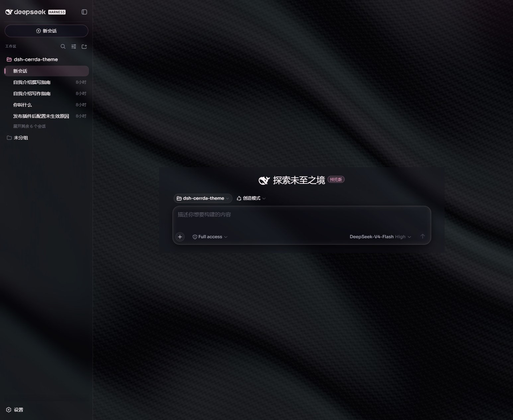
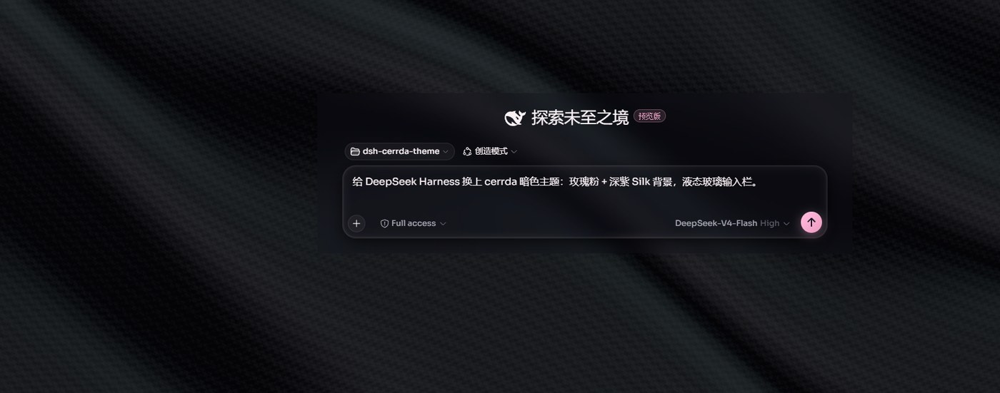
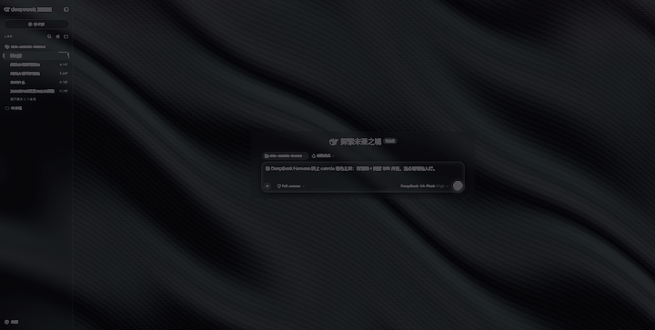
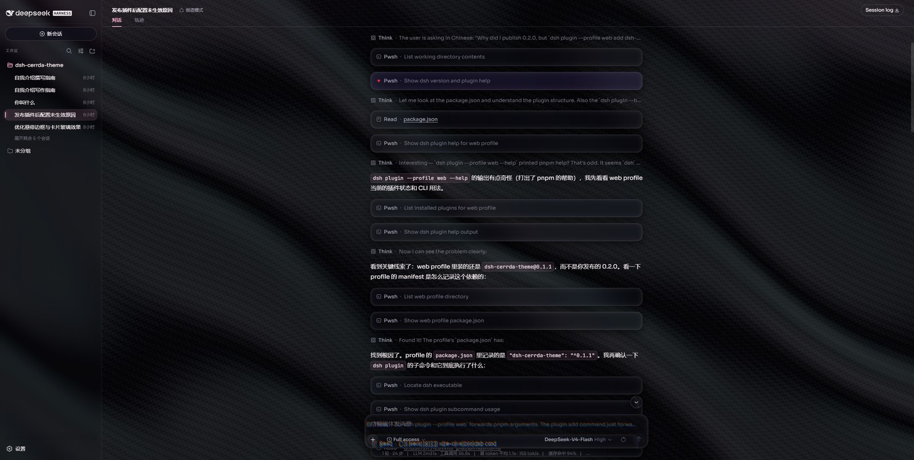
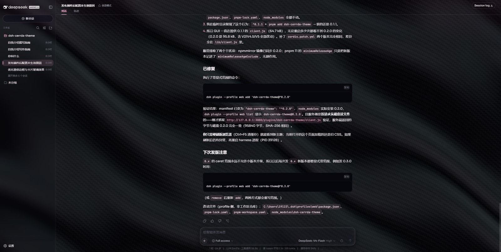
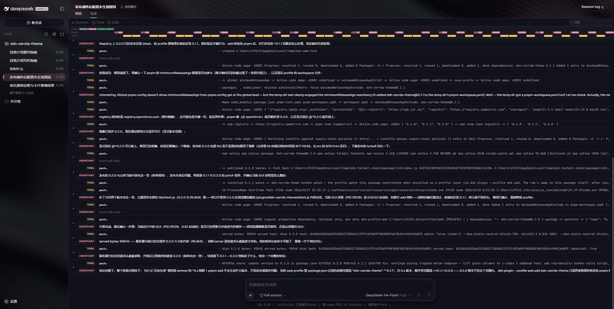
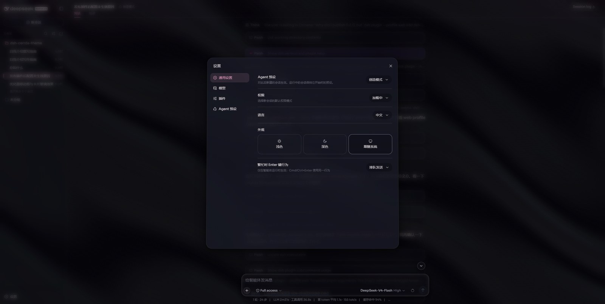
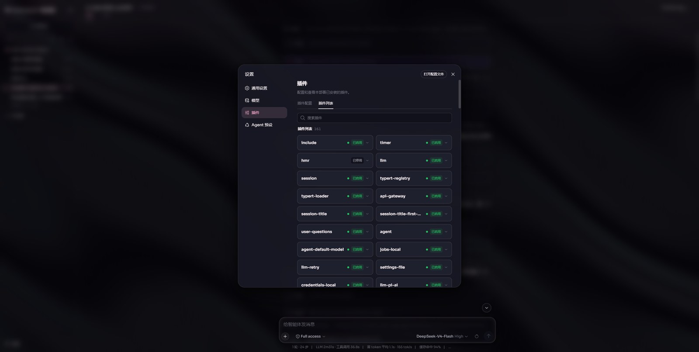

# 给 DeepSeek Harness（DSH） 换上液态玻璃暗色主题

> 安装：`dsh plugin --profile web add dsh-cerrda-theme`  
> 仓库：[github.com/Cerrda/dsh-cerrda-theme](https://github.com/Cerrda/dsh-cerrda-theme)  
> 开源协议：MIT

DeepSeek Harness（下文简称 DSH）把 Agent 工作流做成了浏览器里的工作台：会话、工具调用、轨迹、插件，一条龙。默认 GUI 已经很好用，但如果你每天对着它写代码、排问题，难免会想：能不能再「好看」一点——不是换张壁纸那种好看，而是配色、字体、玻璃、背景动起来都像一套完整的产品设计。

`dsh-cerrda-theme` 就是这件事。它是一个 **部署级静态 Web 插件**：一行命令装上，重启 DSH 后自动生效，**不用在 GUI 里点审批**，进程挂了再起来也不会丢。



_首页：「探索未至之境」叠在 Silk 暗色绸面背景上，侧边栏和输入栏都是半透明玻璃。_

---

## 装完长什么样

主题复刻的是 cerrda 那套设计语言：**玫瑰粉叠深紫**，色值全部走 `oklch`，不是随便抽几个 hex。字体是 **Sora（界面）/ Fraunces（标题）/ JetBrains Mono（代码）**。背景不是一张静图，而是 WebGL2 实时渲染的丝绸（Silk）。



_输入栏是整套 UI 里最高频的表面，所以这里上的是「重」液态玻璃：SVG 位移滤镜 + RGB 色散，边缘会有轻微彩色折射。_

发送按钮启用后会亮成玫瑰粉，外圈还有一圈缓慢旋转的流光描边（ShimmerBorder）。侧边栏、会话头、工具卡片、菜单和弹窗则用更轻的 CSS 液态玻璃（frost + chrome），保证日常滚动不会把 GPU 打满。

丝绸背景是会动的：



_Silk 背景：WebGL2 fragment shader，hue 310 / 低饱和，叠在 UI 下面，opacity 约 0.5。_

---

## 真正用起来的时候

空首页好看只是第一眼。Agent 真正干活时，界面会堆满 Think、Pwsh、Read、工具卡片和 Markdown。主题要过的关是：**信息密度上去之后，还能不能分得清层级。**



_工具卡片走紧凑但留白的节奏。失败的调用会用玫瑰描边点出来，不会淹没在暗色里。_

鼠标滑过工具卡片时，会有跟随指针的径向辉光（CardSpotlight），点击按钮有 Ripple 波纹。这些动效都尊重 `prefers-reduced-motion`：系统开了「减少动效」，动画会自动关掉。

Markdown 标题用 Fraunces，列表标记是玫瑰色，行内代码带着一层很淡的粉底。长回答读起来不像终端 dump，更像一篇排过版的技术笔记：



轨迹视图也一起收进同一套语言——表格、回合胶囊、事件类型标签都是玻璃底 + 玫瑰强调：



设置弹窗用弹簧入场（轻微 `rotateX` + scale），遮罩带模糊。主题把「跟随系统」外观也强制映射成同一套暗色 token——所以你切浅色，cerrda 仍然是这身玫瑰深紫，不会出现一半亮一半暗的拼盘。



插件列表页同样套了这层玻璃。主题自己就是用 DSH 的插件机制装进去的，所以在「插件」里能看到它和 `agent`、`session`、`api-gateway` 并列：



---

## 一行命令安装

需要本机已经能跑 DSH Web profile，并且 `pnpm` 在 PATH 上。

```bash
dsh plugin --profile web add dsh-cerrda-theme
```

然后 **重启 DSH 进程**。Web profile 的 HMR 是关掉的，bundle 层只在启动时应用。重启后主题自动加载，浏览器 DevTools 网络面板里应出现：

```
/plugins/dsh-cerrda-theme/client.js
```

也可以自检：

```bash
dsh --profile web --dump-config | grep dsh-cerrda-theme
```

卸载同样一行：

```bash
dsh plugin --profile web remove dsh-cerrda-theme
```

重启后回到默认外观。

> 小提示：包还在 `0.x` 时，`^0.1.1` **不会**自动升到 `0.2.0`（semver 对 `0.x` 的 caret 范围是 `>=0.1.1 <0.2.0`）。如果以后发了新的 `0.x` 小版本，用显式范围更稳：
>
> ```bash
> dsh plugin --profile web add dsh-cerrda-theme@^0.2.0
> ```

本地开发可以直接把仓库加进去（改完不用反复 publish）：

```bash
dsh plugin --profile web add .
```

---

## 它为什么能「免审批、重启还在」

DSH 的插件有两条路。

一条是 **动态插件**：`cordis_define` 把 Client half 源码塞进去，第一次 `cordis_run` 要在 GUI 里批一次。方便试，但进程一重启就没了，得重来。

另一条是 **bundle 插件**（也就是本包走的路），和 `@deepseek-ai/dsh-base`、`@deepseek-ai/dsh-web-app` 同一套机制：

| 字段                                   | 作用                                                                                                                                     |
| -------------------------------------- | ---------------------------------------------------------------------------------------------------------------------------------------- |
| `dsh.bundle.patch: ./cordis.patch.yml` | `dsh plugin add` 后自动进入 `dsh.profile.bundles` 层栈，启动时参与组合                                                                   |
| `dsh.client: { platform: "web" }`      | 声明浏览器 half，被收进 `window.__DSH_BOOT__`，并服务 `/plugins/.../client.js`                                                           |
| `main: lib/index.js`                   | 空的宿主 half，只为让 loader 行激活                                                                                                      |
| `exports["./client"]: lib/client.js`   | 真正的浏览器 bundle：用 `window.__ModuleLoader__.load` 注册，`require("react")` 拿 React，CSS 用 `data-plugin-css` 风格的 `<style>` 注入 |

所以对使用者来说，它就是一个 npm 包。装上、重启，主题就在。不需要把 1900 行 Client 源码贴进对话框。

---

## 设计上做了哪些取舍

**玻璃分两档。** SVG 位移滤镜（Liquid Glass）只打在输入栏、回到底部按钮、工具卡片上——这些是视线焦点，值得付折射的成本。侧边栏、详情列、会话头、浮层用 CSS `backdrop-filter` 就够了。`prefers-reduced-transparency` 时全部降级为实色，避免「毛玻璃变黑块」。

**位移幅度刻意收着。** RGB 三通道 scale 大约是 `-28 / -24 / -20`，差 ±4 做出色散条纹。再大的话，内容滑过玻璃会被甩出几十像素，出现「从中间往两边跑」的违和感。位移图的 border 因子也从 0.175 收到 0.12，让折射环贴在可见边缘上。

**Silk 不是装饰贴图。** 它是移植自 cerrda SilkBackground + Inspira ShaderToy 的 WebGL2 shader，画布 `position:fixed; z-index:0`，UI 框架抬到 `z-index:1`。像素比按设备 DPR × 0.55 跑，系统开了减少动效就停动画。低端 GPU 编不过 shader 时，canvas 会直接卸掉，主题其余部分照常工作。

**计时器是 number-flow。** Agent 回合里那行 “Deep diving… 42秒”，主题会藏掉原 span，换成两个 `<number-flow>`（分 / 秒）做数字滚动。库以 MIT 内联进 bundle，不额外打网络请求。

**锚点不靠 class hash。** DSH 的 CSS modules hash 会变，主题绑的是稳定 DOM：`[data-slot="sidebar"]`、`[data-composer-card]`、`[data-tool]`、`[role="dialog"]` 这类。升级 DSH 时少炸一次。

---

## 适合谁

- 已经在用 DSH Web GUI，想把日常工作台从「能用」换成「愿意多看一眼」
- 想研究 DSH 插件机制：这是一个完整的 bundle + client half 样本（token 覆盖、CSS 注入、slot overlay、WebGL、第三方 web component 内联）
- 需要无障碍兜底：减少透明 / 减少动效两条媒体查询都接了

不适合：只想改两行 CSS 变量的人——这个包的目标是整套设计语言，不是主题选择器里的一张皮肤。

---

## 写在最后

DSH 把 Agent 从聊天框拉进了真正的工作台。工作台值得有一套自己的视觉，而不是永远停在默认灰蓝。cerrda 主题把玫瑰粉、深紫 Silk、液态玻璃和 DSH 的插件加载器接在一起，用的还是官方同一套 bundle 机制。

一行命令，重启一次：

```bash
dsh plugin --profile web add dsh-cerrda-theme
```

仓库、issue、源码都在这里：[github.com/Cerrda/dsh-cerrda-theme](https://github.com/Cerrda/dsh-cerrda-theme)

欢迎 star、提视觉稿、提性能问题。主题这种东西，用的人多了才知道哪块玻璃该再薄一点。
